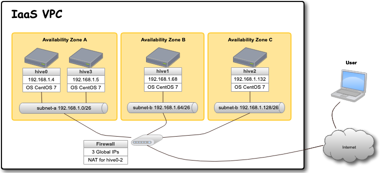
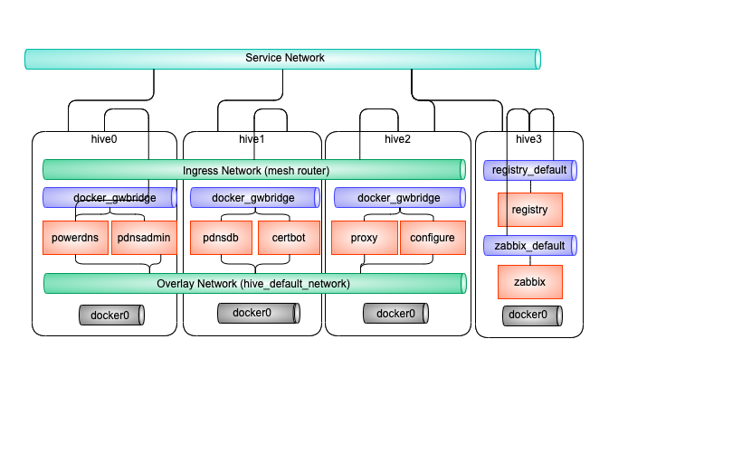

====================
インベントリ
====================
hive-builder のインベントリは以下の2つからなります。

hive 定義
  サーバやネットワークで構成される基盤（infrastructure）を定義する

サービス定義
  コンテナイメージ、ボリューム、内部ネットワークで構成されるサービスを定義する

.. _defineHive:

hive 定義
====================
hive 定義では基盤を構成するサーバやネットワークを記述します。

IaaS 上にサイトを構築する場合、コンテナ収容サーバは3つの Availability Zone
に分かれて配置されます。以下にその例を示します。

hive 定義のフォーマット
---------------------------
hive 定義のフォーマットは以下の通り。

============  ==============  ============  ================================================
パラメータ    選択肢/例       デフォルト    意味
============  ==============  ============  ================================================
plugin        hive_inventory  必須          このファイルがhive定義で有ることを示す
name          pdns            必須          hive の名前
stages        ..              ..            | ステージオブジェクトへの辞書
                                            | private, staging, production の3つが定義できる
============  ==============  ============  ================================================

stages の下にステージ名をキーとしてステージオブエクトを指定します。以下に例を
示します。

::

  plugin: hive_inventory
  stages:
    private:
      provider: vagrant
      separate_repository: False
      cidr: 192.168.0.96/27
      memory_size: 4096
      mirrored_disk_size: 10
      number_of_hosts: 1
    production:
      provider: aws
      separate_repository: False
      cidr: 192.168.0.0/24
      instance_type: t3.medium
      region: ap-northeast-1
      mirrored_disk_size: 20
      repository_instance_type: t3.large
      subnets:
      - cidr: 192.168.0.0/26
        name: subnet-a
        available_zone: ap-northeast-1d
      - cidr: 192.168.0.64/26
        name: subnet-b
        available_zone: ap-northeast-1b
      - cidr: 192.168.0.128/26
        name: subnet-c
        available_zone: ap-northeast-1c

この例では、private ステージと production ステージが定義されています。
private ステージは vagrant で VirtualBox 上に 4G のメモリの
サーバ1台を構築します。

production ステージでは aws 上に t3.medium のサーバ3台を
東京リージョンの3つの可用性ゾーンに分けて構築します。
リポジトリサーバは3台目のコンテナ収容サーバと兼用し、
t3.large で構築します。

ステージオブジェクト
-----------------------------
ステージオブジェクトのフォーマットは以下の通り。

..  list-table::
    :widths: 18 18 18 50
    :header-rows: 1

    * - パラメータ
      - 選択肢/例
      - デフォルト
      - 意味
    * - provider
      - - aws
        - azure
        - gcp
        - prepared
        - kickstart
        - vagrant
      - 必須
      - 基盤を提供するシステム
    * - cidr
      - 192.168.1.0/24
      - 必須
      - ネットワークのアドレス
    * - number_of_hosts
      - 1
      - 4 if separate_repository else 3
      - サーバの台数
    * - separate_repository
      - - True
        - False
      - True
      - リポジトリサーバをコンテナ収容サーバとは別に建てるか否か
    * - subnets
      - 後述
      -
      - サブネットの定義のリスト
    * - ip_address_list
      - ["192.168.20.5","192.168.20.6"]
      -
      - IPアドレスのリスト
    * - disk_size
      - 16
      - プロバイダによる
      - コンテナ収容サーバの起動ディスクのサイズ（GBytes)
    * - repository_disk_size
      - 16
      - プロバイダによる
      - リポジトリサーバの起動ディスクのサイズ（GBytes)
    * - mirrored_disk_size
      - 16
      - 必須
      - drbdで複製同期するディスクのサイズ（GBytes)
    * - root_password
      - X12bv5riykfid
      - ""
      - 最初に ssh でログインするためのユーザを作成する必要がある場合に root のパスワードを指定する
    * - internal_cidr
      - 10.254.0.0/16
      - 172.31.252.0/22
      - docker コンテナがコンテナ間やホストとの通信に使用するネットワークのアドレス
    * - nameservers
      - ["192.168.0.1", "192.168.0.2"]
      - ""
      - kickstart プロバイダの場合にDNSのサーバのIPアドレスを指定する

上記はプロバイダ共通の属性ですが、プロバイダ固有の属性もあります。
以下にプロバイダ固有の属性をプロバイダごとに説明します。

IPアドレスと可用性ゾーンの割当
^^^^^^^^^^^^^^^^^^^^^^^^^^^^^^^^^^^^
IPアドレスと可用性ゾーンの割当は以下のルールで行われます。
ただし、subnet 属性はプロバイダごとに指定できなかったり、
必須であったりしますので、プロバイダごとに割当方法が
異なります。

subnets が指定されている場合：
サーバは subnets に指定されたsubnetオブジェクトに順に割り振られます。
サーバの台数のほうがsubnetオブジェクトの数よりも大きい場合は、
先頭に戻ります。
サーバのIPアドレスは subnetオブジェクトに指定されたCIDR から
自動的に割り振ります。サーバはsubnetオブジェクトの
available_zone属性で指定された可用性ゾーンに配備されます。

ip_address_list が指定されている場合：
サーバのIPアドレスは ip_address_list から順に割り当てられます。
ip_address_listの要素数はサーバの台数と一致しなければなりません。
アベラブルゾーンは自動的にできるだけ分散するように割り振ります。

上記以外の場合：
サーバのIPアドレスは cidr 属性から自動的に割り振ります。
アベラブルゾーンは自動的にできるだけ分散するように割り当てます。

docker が内部的に使用するネットワークのアドレス
^^^^^^^^^^^^^^^^^^^^^^^^^^^^^^^^^^^^^^^^^^^^^^^^
コンテナ間通信やコンテナとホスト間通信には docker が必要に応じて作成する仮想ブリッジが使用されます。
このような仮想ブリッジ内でコンテナやホストに割り当てられるIPアドレスは外から見えることはありませんが、
コンテナから外部に通信する際にIPアドレスが重複していると接続することができません。
このため、仮想ブリッジのネットワークのアドレスも外部とかぶらないように割り当てる必要があります。
これらのネットワークのアドレスは、デフォルトではdocker デーモンが適宜 LOCALなIPアドレス領域から割り当てますが、
hive定義の internal_cidr プロパティで変更できます。
以下に swarm クラスタで利用される仮想ブリッジの種別について説明します。

..  list-table::
    :widths: 18 50 18 20
    :header-rows: 1

    * - 種別
      - 説明
      - 接続の条件
      - 比率
    * - Overlay
      - docker swarm クラスタに分散して配置されるコンテナ間で通信するためのネットワークで、異なるサーバのコンテナと仮想的なネットワークで通信する。管理セグメント内をトンネリングして実装されるVPNである。
      - サービスのコンテナはデフォルトで接続される
      - 1/4
    * - Ingress
      - docker swarm クラスタで内のコンテナが負荷分散モードでサービスを公開するときに利用するネットワークで、サーバ間の仮想的なネットワークで通信する。管理セグメント内をトンネリングして実装されるVPNである。
      - サービスのコンテナがポートを公開すると接続される
      - 1/4
    * - docker_gwbridge
      - サーバ内で動作している swarm モードのコンテナが属するネットワークでサーバ上に設置されたブリッジを経由し外部と接続できる。このとき、コンテナ側のアドレスは NAT により、サーバのアドレスに付け替えられる。
      - サービスのコンテナはデフォルトで接続される
      - 1/8
    * - docker0
      - swarmモードでないコンテナが属するネットワークでサーバ上に設置されたブリッジを経由し外部と接続できる。このとき、コンテナ側のアドレスは NAT により、サーバのアドレスに付け替えられる。
      - 非swarmモードのコンテナのみが接続される
      - 1/8
    * - registry_default
      - リポジトリサーバ上のリポジトリサービスが使用するネットワークである。コンテナ側のアドレスは NAT により、サーバのアドレスに付け替えられるが、リポジトリサーバ内の別のコンテナへの通信の場合は付け替えられない。
      - リポジトリサービスのコンテナのみが接続される
      - 1/8
    * - zabbix_default
      - リポジトリサーバ上の zabbix が使用するネットワークである。コンテナ側のアドレスは NAT により、サーバのアドレスに付け替えられるが、リポジトリサーバ内の別のコンテナへの通信の場合は付け替えられない。
      - zabbixのコンテナのみが接続される
      - 1/8

ここで、比率とは internal_cidr で指定されたネットワークを分割して割り当てる際の比率を示しています。
以下に上記種別の接続関係の例を簡略化して図に示します。

vagrant プロバイダ
^^^^^^^^^^^^^^^^^^^
vagrant プロバイダを利用するには、 Vagrant がインストールされていて、 virtualbox か libvirt の Vagrant プロバイダ
がセットアップされている必要があります。また、 vagrant-disksize プラグインがインストールされている
必要があります。詳細についてはインストールの章を参照してください。

vagrant プロバイダ固有の属性には以下のものがあります。

..  list-table::
    :widths: 18 18 18 50
    :header-rows: 1

    * - パラメータ
      - 選択肢/例
      - デフォルト
      - 意味
    * - memory_size
      - 4096
      - Vagrant のデフォルト
      - コンテナ収容サーバに割り当てるメモリのサイズで(MBytes)
    * - repository_memory_size
      - 4096
      - Vagrant のデフォルト
      - リポジトリサーバに割り当てるメモリのサイズで(MBytes)
    * - cpus
      - 2
      - Vagrant のデフォルト
      - サーバに割り当てる仮想CPUの個数
    * - bridge
      - brHive
      - ''
      - 外部のネットワークへブリッジ経由で接続するための仮想ブリッジをこの名前で生成する
    * - dev
      - brHive
      - ''
      - この名前の既設の仮想ブリッジに接続する（Vagrantプロバイダが libvirt である場合のみ利用できる）

- disk_size, repository_disk_size を省略した場合、Vagrant のデフォルトのサイズになります。
- subnets 属性は指定できません
- bridge, dev のどちらも指定しない場合、ホストオンリーネットワークに接続されます。

aws プロバイダ
^^^^^^^^^^^^^^^^^^^
aws プロバイダ固有の属性には以下のものがあります。

..  list-table::
    :widths: 18 18 18 50
    :header-rows: 1

    * - パラメータ
      - 選択肢/例
      - デフォルト
      - 意味
    * - instance_type
      - t3.medium
      - 必須
      - コンテナ収容サーバのインスタンスタイプ
    * - repository_instance_type
      - t3.medium
      - 必須
      - リポジトリサーバのインスタンスタイプ
    * - region
      - ap-northeast-1
      - 必須
      - 構築先のリージョン

aws プロバイダを使用する場合は、以下のコマンドで hive の環境に AWS EC2 API の鍵を設定する必要があります。

::

  hive set aws_access_key_id アクセスキーID
  hive set aws_secret_access_key アクセスキー

gcp プロバイダ
^^^^^^^^^^^^^^^^^^^^^
gcp プロバイダ固有の属性には以下のものがあります。

..  list-table::
    :widths: 18 18 18 50
    :header-rows: 1

    * - パラメータ
      - 選択肢/例
      - デフォルト
      - 意味
    * - instance_type
      - n1-standard-2
      - 必須
      - コンテナ収容サーバのインスタンスタイプ
    * - repository_instance_type
      - n1-standard-2
      - 必須
      - リポジトリサーバのインスタンスタイプ
    * - region
      - asia-northeast2
      - 必須
      - 構築先のリージョン

gcp プロバイダを使用する場合は、プロジェクトのルートディレクトリに gcp_credential.json という
名前でサービスアカウントキーを保持するファイルを置く必要があります。
サービスアカウントキーについては、
https://cloud.google.com/iam/docs/creating-managing-service-account-keys?hl=ja
を参照してください。
鍵の形式でJSONを選択して、プロジェクトのルートディレクトリに gcp_credential.json という名前で保存してください。

azure プロバイダ
^^^^^^^^^^^^^^^^^^^^^
azure プロバイダ固有の属性には以下のものがあります。

..  list-table::
    :widths: 18 18 18 50
    :header-rows: 1

    * - パラメータ
      - 選択肢/例
      - デフォルト
      - 意味
    * - instance_type
      - n1-standard-2
      - 必須
      - コンテナ収容サーバのインスタンスタイプ
    * - repository_instance_type
      - n1-standard-2
      - 必須
      - リポジトリサーバのインスタンスタイプ
    * - region
      - asia-northeast2
      - 必須
      - リソースグループのロケーション

azure プロバイダを使用する場合は、 Azure AD アプリケーションを作成し、
仮想マシーンやネットワークの課金先のサブスクリプションに
サービスプリンシパルとしてアプリケーションを設定（ロールを割り当てる）していただく必要があります。
Azure ポータルで作成する場合は、Azure のオフィシャルサイト
`方法:リソースにアクセスできる Azure AD アプリケーションとサービスプリンシパルをポータルで作成する
<https://docs.microsoft.com/ja-jp/azure/active-directory/develop/howto-create-service-principal-portal>`_
を参照してください。

作成後、以下のコマンドで、そのクレデンシャルを認証情報として hive 変数に設定してください。

::

    hive set azure_client_id ...
    hive set azure_secret ...
    hive set azure_subscription_id ...
    hive set azure_tenant ...

azure_subscription_id にはポータルの「サブスクリプション」サービスで、表示されるサブスクリプションIDを設定してください。
azure_client_id には、ポータルの「Azure Active Directory」サービスの「アプリの登録」からアプリケーションを選択したときに表示される「アプリケーション（クライアントID）」の値を設定してください。
azure_tenant には、ポータルの「Azure Active Directory」サービスの「アプリの登録」からアプリケーションを選択したときに表示される「ディレクトリ（テナント）」の値を設定してください。
azure_secret には、アプリケーション上に作成したシークレットの値を設定してください。シークレットの値は作成時にしか表示されないため、値が不明の場合はシークレットを作り直してください。

region 属性にはAzure Location をコードで指定してください。
有効な値のリストは `Azure Cloud Shell <https://shell.azure.com/>`_ 上で以下のコマンドを実行して取得することができます。

::

    Get-AzureRmLocation |Format-Table

instance_type 属性、repository_instance_type には VM のサイズをコードで指定してください。
有効な値のリストは `Azure Cloud Shell <https://shell.azure.com/>`_ 上で以下のコマンドを実行して取得することができます。

::

    Get-AzureRmVMSize -Location region属性の値

kickstart プロバイダ
^^^^^^^^^^^^^^^^^^^^^
kickstart プロバイダは OS のインストール媒体を生成します。
インストール媒体は、USBメモリ、DVD、isoイメージファイルに出力できます。
VirtualBox や iDRAC で OS を最初からインストールする際に
このインストール媒体をセカンダリの光学ドライブとしてマウントして利用できます。

kickstart プロバイダを利用するには motherマシンは linux でなければなりません。
また、現在のバージョンではサーバは UEFI ブート可能なものである必要があります。

kickstart プロバイダを利用する場合は、ステージオブジェクトに kickstart_config 属性に
サーバのインストールパラメータを指定してください。 kickstart_config 属性には
以下の属性が指定できます。

..  list-table::
    :widths: 18 18 18 50
    :header-rows: 1

    * - パラメータ
      - 選択肢/例
      - デフォルト
      - 意味
    * - iso_src
      - /var/lib/isos/CentOS-7-x86_64-Minimal-2003.iso
      - 必須
      - 元となるOSのインストール媒体（媒体が挿されているデバイス名かISOイメージのファイル名）
    * - iso_dest
      -  /dev/sda
      - 必須
      - インストール媒体の出力先（媒体が挿されているデバイス名かISOイメージのファイル名）
    * - media_usb
      - - True
        - False
      - False
      - インストール媒体がUSBであるかいなか
    * - networks
      - 未執筆
      - 必須
      - ネットワーク定義オブジェクトのリスト

以下にkickstart_configの例を示します。

::

    kickstart_config:
      iso_src: /var/lib/isos/CentOS-7-x86_64-Minimal-2003.iso
      iso_dest: /dev/sda
      media_usb: True
      networks:
      - interface: bond0
        bonding_interfaces:
        - eth0
        - eth1
        ips:
        - 192.168.200.20
        - 192.168.200.21
        - 192.168.200.22
        netmask: 255.255.255.0
      - interface: bond0
        vlanid: 2
      - interface: bond0
        vlanid: 4
      - interface: bond0
        vlanid: 1000
      - interface: bond0
        vlanid: 1001
      - interface: bond0
        vlanid: 1002
        ips:
        - 192.168.203.20
        - 192.168.203.21
        - 192.168.203.22
        netmask: 255.255.255.0
        gateway: 192.168.203.1
        nameservers:
        - 192.168.203.1
      - interface: bond0
        vlanid: 1003
      - interface: bond0
        vlanid: 1004

prepared プロバイダ
^^^^^^^^^^^^^^^^^^^
prepared プロバイダは OS がインストール済みのホストが
事前に用意されている場合に使用します。
以下に prepared プロバイダの hive 定義の例を示します。

::

  staging:
    provider: prepared
    separate_repository: False
    cidr: 192.168.0.96/27
    ip_address_list:
    - 192.168.0.98
    - 192.168.0.99
    - 192.168.0.100
    root_password: mzYY3qjdvBiD

root_password が指定された場合は、build-infra フェーズは
鍵認証ではなく root ユーザでパスワードでログインして実行されます。
mother 環境が CentOS の場合、 root_password を使用して build-infra を実行するためには、 sshpass パッケージが必要ですので、以下を実行して事前にインストールしておいてください。

::

  yum install sshpass

build-infra フェーズで ssh 鍵を生成し、 hive_admin で指定された
ユーザを作成して、 authorized_keys を設定します。

複製同期用デバイスの割当
^^^^^^^^^^^^^^^^^^^^^^^^^^
hiveでは、デフォルトで複製同期用のデバイスを使用し、そのデバイスに drbd の複製同期ディスクを割り当てます。
各プロバイダは自動的に mirrored_disk_size で指定された大きさで複製同期用デバイスを作成しますが、prepared プロバイダの場合は、事前に複製同期用のデバイスを割り当てて、ホストのデバイスとして見えている必要があります。
複製同期用のデバイスは以下のうちのいずれかの名前である必要があります。

- /dev/sdc
- /dev/sdb
- /dev/vdc
- /dev/vdb
- /dev/xvdb
- /dev/nvme1n1
- /dev/sda

また、場合によって、複製同期用デバイスを持たないホストを作成したい場合もあります。その場合、ホストの hive_no_mirrored_device 変数に True を設定することで、当該ホストの複製同期用デバイスが無いものとして扱われます。
たとえば、inventory/host_vars/hive2.pdns.yml に以下のように指定すると hive2.pdns には複製同期用のデバイスは無いものとして扱われます。

::

    hive_no_mirrored_device: True

この変数に True を指定した場合、以下の仕様となります。

- 各プロバイダで複製同期用のディスクを作成しません
- setup-hosts フェーズの drbd のインストール時の複製同期用のディスクの初期化処理をスキップします
- build-volumes フェーズで drbd リソースを作成する際、当該ホスト上では diskless として設定します。

.. 台数をへらす方法：リポジトリサーバの分割、1台だけで動作

サービス定義
====================
サービス定義には、サービスをどのように構築するかが書かれます。以下の属性を記述できます。

..  list-table::
    :widths: 18 18 18 50
    :header-rows: 1

    * - パラメータ
      - 選択肢/例
      - デフォルト
      - 意味
    * - available_on
      - ["production"]
      - ["production", "staging", "private"]
      - サービスが有効になるステージ
    * - backup_scripts
      - 後述
      - []
      - バックアップ、リストア、夜間バッチのスクリプト（詳細後述）
    * - command
      - ["--api=yes", "--api-key={{db_password}}"]
      - イメージの command の値
      - サービス実行時にentrypoint に与えられる引数（entrypoint が [] の場合、1個めが実行コマンドとなる）
    * - dns
      - "192.168.1.2"
      - ""
      - サービス内で使用するDNSサーバのアドレス（docker service create の --dns オプションと等価）
    * - endpoint_mode
      - - VIP
        - DNSRR
      - VIP
      - エンドポイント・モード（docker service create の --endpoint-mode オプションと等価）
    * - entrypoint
      - ["/docker-entrypoint.sh"]
      - イメージの entorypoint の値
      - サービスの起動時に実行されるコマンド
    * - environment
      - {"MYSQL_PASSWORD": "{{db_password}}, "MYSQL_HOST": "pdnsdb"}
      - {}
      - サービス実行時にプロセスに付与される環境変数（docker service create の --env オプションと等価）
    * - hosts
      - {"test.example.com": "192.168.1.2"}
      - {}
      - サービス内の /etc/hosts ファイルに追加するホスト名をキーとしたIPアドレスの辞書（docker service create の --hosts オプションと等価）
    * - image
      - 後述
      - []
      - サービスのもととなるコンテナイメージの取得方法（詳細後述）
    * - initialize_roles
      - ["python-aptk", "powerdns"]
      - []
      - サービスのイメージのビルド時に適用される role 名のリスト
    * - labels
      - {"published_fqdn": "pdnsadmin.pdns.procube-demo.jp"}
      - {}
      - サービスに付与されるラベル（ラベル名と値の dict を指定する。値に文字列以外のものを指定すると JSON 文字列化されるが、 constraint などで使用する場合には文字列としてしか参照できないので注意を要する）
    * - logging
      - {"driver": "journald", "options": {"tag": "powerdns"}}
      - {"driver": "fluentd", "options": {"fluentd-address": リポジトリサーバ:24224}}
      - サービスのログ出力方法（docker service create の --log-driver("driver"に指定), --log-opt（"options"に指定） オプションと等価）
    * - mode
      - - replicated
        - global
      - replicated
      - サービス・モード（docker service create の --mode オプションと等価）
    * - placement
      - {"constraints": "node.hostname!=hive2"}
      - {}
      - サービスの配置に関するルールを constraints 属性、 preferences 属性で指定する（docker service create の --constraint （"constraints"に指定）, placement-pref（"preferences"に指定） オプションと等価）
    * - ports
      - "80:8080"
      - []
      - サービス実行時に外部に公開するポート（詳細後述）
    * - replicas
      - 3
      - -1
      - | サービスでインスタンス化されたコンテナの複製数。mode 属性が replicated である場合にのみ有効です。（docker service create の --replicas オプションと等価）
        | ・1に設定され、サービスが存在しない場合、複製数は1に設定されます。
        | ・1に設定され、サービスが存在する場合、複製数は変更されません。
    * - restart_config
      - {"restart_config": {"condition": "on-failure", "delay": "5s", "max_attempts": 3, "window": "120s"}}
      - []
      - 再起動に関する設定（docker service create の --restart-condition("condition", "max_attempts"に指定) --restart-window("window"に指定) --restart-delay（"delay"に指定）オプションと等価）
    * - standalone
      - - True
        - False
      - False
      - サービスをスタンドアローン型として実行するか否か（詳細後述）
    * - user
      - admin
      - イメージの user の値
      - サービスを実行するプロセスのユーザID（docker service create の --user オプションと等価）
    * - volumes
      - 後述
      - []
      - サービス実行時にコンテナにマウントするボリューム（詳細後述）
    * - working_dir
      - /opt/wildfly
      - 省略
      - コンテナのプロセスの working diretory（docker service create の --workdir オプションと等価）

volumes 属性
-----------------------------

volumes 属性には、そのサービスが利用するボリュームの内容を記述できます。
また、 必要に応じて build-volumes フェーズでボリュームを作成することができます。
以下の属性を持つボリュームオブジェクトのリストを指定してください。

..  list-table::
    :widths: 18 18 18 50
    :header-rows: 1

    * - パラメータ
      - 選択肢/例
      - デフォルト
      - 意味
    * - target
      - /var/lib/mysql
      - 必須
      - コンテナ上のマウントポイント
    * - type
      - volume
      - bind
      - マウントタイプ（drbdの場合は volume を指定、ホストのディレクトリをマウントする場合は bind を指定）
    * - readonly
      - - True
        - False
      - False
      - ボリュームを読み取り専用でマウントするか否か
    * - driver
      - local
      - local
      - ボリュームを作成する際のドライバ（drbd属性と同時に指定することはできません）
    * - driver_opts
      - {device: "/dev/sda2"}
      - {}
      - ボリュームを作成する際のドライバのオプション（drbd属性と同時に指定することはできません）
    * - drbd
      - {fstype: "xfs", size: "500M"}
      - omit
      - drbd のボリュームを作成する場合の作成内容（driver 属性と同時に指定することはできません）

drbd 属性、driver属性のいずれかを指定すると対応するボリュームが build-volume フェーズで
作成されます。

drbd属性
^^^^^^^^^
hive環境ではdocker swarm の機能により、コンテナがサーバ間を移動するため、
ボリュームは原則として drbd によりすべてのコンテナ収容サーバ間で複製同期
しておく必要があります。このためには、volume 属性に drbd 属性を指定してください。
drbd 属性はオブジェクトであり、以下の属性を指定できます。

..  list-table::
    :widths: 18 18 18 50
    :header-rows: 1

    * - パラメータ
      - 選択肢/例
      - デフォルト
      - 意味
    * - fstype
      - - xfs
        - ext4
      - 必須
      - ファイルシステムのタイプを指定
    * - size
      - 100M
      - 必須
      - ボリュームのサイズを100M, 20G などのように単位を付与した文字列で指定
    * - diskless
      - ['s-hive1.pdns', 'hive1.pdns']
      - []
      - このボリュームを diskless  とするサーバのリスト

fstype について、小さいボリュームに xfs を指定すると、領域のムダが大きく、また、フォーマットで
エラーになる場合があります。100M 以下のボリュームについては ext4 が推奨されます。
大きいボリュームでは xfs が推奨されます。
xfs でフォーマットすると、ボリュームの初期データは docker のコンテナに
マウントする際にディレクトリが空っぽであることを契機としてマウント前の
データがコピーされます。ext4 でフォーマットすると lost+found ディレクトリが
存在するため、空っぽであると認識されずこの機能は動作しませんので、注意が必要です。

image属性
-----------------------------

image 属性には、そのサービスを構成する docker コンテナのイメージの取得方法を記載してください。
image 属性には、以下のいずれかを設定できます。
- タグ指定（文字列が指定された場合）
- ビルド方法指定（オブジェクトが指定された場合）

タグ指定
^^^^^^^^^^^^^^^^^^^
image 属性に文字列を指定すると、それはイメージのタグとみなされます。
サービスの起動時には、 docker pull により、タグに対応するイメージを
ダウンロードします。

ビルド方法指定
^^^^^^^^^^^^^^^^^^^
image 属性にオブジェクトを指定すると、イメージのビルド方法の指定とみなされます。
この場合、その内容に従って、 build-images フェーズでコンテナ
イメージがビルドされ、リポジトリサーバのプライベートリポジトリに push されます。
ビルド方法指定には以下の属性が指定できます。

..  list-table::
    :widths: 18 18 18 50
    :header-rows: 1

    * - パラメータ
      - 選択肢/例
      - デフォルト
      - 意味
    * - from
      - mariadb:10.4
      - 必須
      - ビルドのもととなるイメージのタグ
    * - roles
      - ['python-aptk', 'powerdns']
      - 必須
      - ビルド時に適用する role のリスト（対応する role が roles ディレクトリ配下に定義されていなければならない）
    * - standalone
      - - True
        - False
      - False
      - ビルド時にスタンドアローン型としてビルドするか否か
    * - env
      - {"HTTPD_USER": "admin"}
      - {}
      - イメージの設定：ビルドで追加される環境変数
    * - stop_signal
      - "2"
      - "15"
      - イメージの設定：コンテナを終了させる場合にルートプロセスに送られるシグナルの番号
    * - user
      - admin
      - root
      - イメージの設定：コンテナでルートプロセスを起動する際のユーザID
    * - working_dir
      - /home/admin
      - /
      - イメージの設定：コンテナでルートプロセスを起動する際の作業ディレクトリ
    * - entrypoint
      - /docker_entrypoint.sh
      - "[]"
      - イメージの設定：コンテナの entrypoint
    * - command
      - ["--api-port","5000"]
      - "[]"
      - イメージの設定：コンテナのデフォルト command
    * - privileged
      - - True
        - False
      - False
      - イメージの設定：コンテナのプロセスに特権を与えるか否か
    * - pull_on
      - ["production"]
      - 省略可能
      - 指定されたステージではイメージのビルドを行わず、 pull_from に指定されたイメージを使用する
    * - pull_from
      - procube/certbot
      - 省略可能
      - pull_on に指定されたステージでサービスを deploy する際のイメージのタグ。イメージはタグのリポジトリからダウンロードされる。

ビルトインrole
^^^^^^^^^^^^^^^^^^^
python-aptk はビルトイン role であり、イメージのビルド時に role 定義を行わずに使用できます。
build-images フェーズでは、 ansible で中身を構築するため、
ビルド用に起動したコンテナに python がインストールされていなければなりません。
しかし、 ubuntu や alpine をベースとしたイメージには python がインストールされていないものが
多々あります。このような場合、ビルドの最初の roleとして python-aptk を指定してください。
python-aptk には以下のようにタスクが定義されており、ubuntu や alpine をベースとした
コンテナに python をインストールできます。

::

    - name: install python
      raw: if [ -x /usr/bin/apt-get ]; then (apt-get update && apt-get -y install python3); else (apk update && apk add python3); fi
      changed_when: False

プライベートリポジトリ上のタグとイメージの共有
^^^^^^^^^^^^^^^^^^^^^^^^^^^^^^^^^^^^^^^^^^^^^^^
build-images でビルドされたイメージはプライベートリポジトリに push
されます。このときのタグは、以下のようになります。

リポジトリサーバ名:5000/image_サービス名

例：separate_repository=True の production ステージの powerdns サービスのイメージの場合

::

    hive3.pdns:5000/image_powerdns

build-images でビルドするイメージを複数のサービスで共有するためには、
最初のサービス定義で image 属性にオブジェクトを指定してビルドし、
二個目以降のサービスではimage 属性にプライベートリポジトリ上のタグを
指定してイメージを参照する必要があります。

外部リポジトリを経由したイメージのリリース
^^^^^^^^^^^^^^^^^^^^^^^^^^^^^^^^^^^^^^^^^^^^^^^
staging ステージの build-images でビルドされたイメージを外部リポジトリに push し、これをproduction ステージから参照するように設定できます。
例えば、imgage オブジェクトで以下のように指定すると、production ステージでは、 build-images でのビルドを skip し、代わりに外部リポジトリからイメージをダウンロードします。

::

      pull_on:
        - production
      pull_from: procube/pdnsadmin_test

staging ステージでテストし、イメージをリリースできる状態になったら、外部リポジトリに push します。
例えば、pdnsadmin サービスのイメージを procube/pdnsadmin_test にリリースする場合、以下のコマンドを実行します。

::

    $ docker tag s-hive2.pdns:5000/image_pdnsadmin:latest procube/pdnsadmin_test:latest
    $ docker push  procube/pdnsadmin_test:latest

この後、production ステージで pdnsadmin サービスをデプロイすると、外部リポジトリからイメージがダウンロードされます。

standalone属性
-----------------------------
docker のコンテナはスタンドアローン型とマイクロサービス型の2種類に分類することができます。

=================== =================================================================================
型                  説明
=================== =================================================================================
スタンドアローン型  - centos:7 などスーパバイザ機能を持った OS のイメージをベースとして構築する
                    - 実行時には /sbin/init を起動する
                    - systemd により内部のプロセスが管理される
マイクロサービス型  - dockerhub のオフィシャルイメージをベースとして構築する
                    - ベースの OS はUbuntuやalpineなどの軽量 OS を採用する
                    - 実行時にはサービスを提供するプロセス1個を起動する
=================== =================================================================================

コンテナがスタンドアローン型である場合、standalone 属性にTrue を指定してください。
スタンドアローン型かマイクロサービス型かで、イメージのビルド時の entrypoint の値とデフォルトボリュームの値が異なります。

ビルド時の entrypoint の値
^^^^^^^^^^^^^^^^^^^^^^^^^^^^^^^^^^^^^^^^^^^^^^
build-images フェーズでスタンドアローン型のコンテナをビルドする場合（standalone属性が True で image 属性にビルド方法が指定されている場合）は、
from に指定されたイメージのデフォルトのentrypoint, command でコンテナを起動します。
これにより、ルートプロセスとして /sbin/init が起動され、ビルドが終了してシャットダウンされるまで仮想マシンとして動作し、
ansible でコンテナにプロビジョニングすることができます。

build-images フェーズでマイクロサービス型のコンテナをビルドする場合（standalone属性が False で image 属性にビルド方法が指定されている場合）は、
ルートプロセスとして、以下のような sleep をし続ける1行のシェルスクリプトが起動されます。

::

     /bin/sh -c 'trap "kill %1" int;sleep 2400 &wait'

このコマンドでルートプロセスが 40分間sleepするため、その間に ansible でコンテナにプロビジョニングできます。
ビルドが終了すると、ルートプロセスに INT シグナルが送られ、コンテナは停止します。

デフォルトボリュームの値
^^^^^^^^^^^^^^^^^^^^^^^^^^^^^^^^^^^^^^^^^^^^^^
サービスがスタンドアローン型である場合、以下のボリュームが volumes に暗黙的に追加されます。

::

    - source: '/sys/fs/cgroup'
      target: /sys/fs/cgroup
      readonly: True
    - source: ''
      target: /run
      type: tmpfs
    - source: ''
      target: /tmp
      type: tmpfs

ports 属性
-----------------------------
ports 属性にはポート定義のリストを指定できます。ポート定義の属性は以下のとおりです。

..  list-table::
    :widths: 18 18 18 50
    :header-rows: 1

    * - Option
      - Short syntax
      - Long syntax
      - Description
    * - published_port and target_port
      - "8080:80"
      - {published_port:8080, target_port: 80}
      - The target port within the container and the port to map it to on the nodes, using the routing mesh (ingress) or host-level networking. More options are available, later in this table. The key-value syntax is preferred, because it is somewhat self-documenting.
    * - mode
      - Not possible to set using short syntax.
      - {published_port:8080, target_port: 80, mode: "host"}
      - The mode to use for binding the port, either ingress or host. Defaults to ingress to use the routing mesh.
    * - protocol
      - "8080:80/tcp"
      - {published_port: 8080, target_port: 80, protocol: "tcp"}
      - The protocol to use, tcp , udp, or sctp. Defaults to tcp. To bind a port for both protocols, specify the -p or --publish flag twice.

また、サービス定義では published_port を省略できます。Short Syntax で "80" のように1個のポート番号を記載した場合や、Long Syntax で published_port 属性を
省略した場合は、hive-builder が自動的に 61001 から順にポート番号を割り当てます。
これらはサービスのホスト変数で調べることができます。たとえば、外からそのポートに接続するためにポート番号を調べる場合、initialize-services から起動される
role で以下のように参照することができます。

::

    pdns_port: "{{ hostvars['powerdns'].hive_ports | selectattr('target_port', 'eq', 8081) | map(attribute='published_port') | first }}"

(サービス定義のbackup_scripts, volumes 属性の詳細については未執筆)