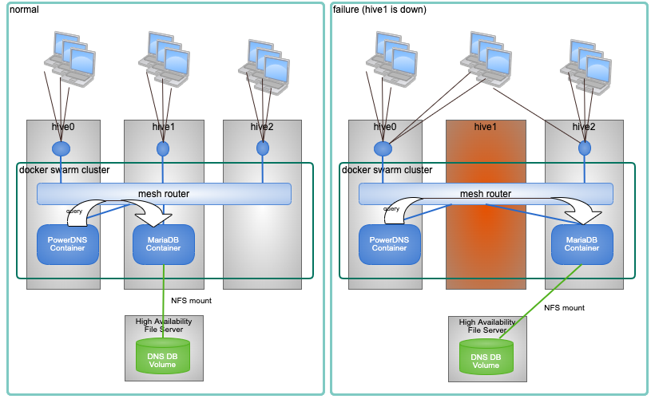

NFS の利用
===============================
hive-builder では NFSボリュームを使用することができます。
NFS で高可用性ストレージをマウントすることで、 DRBD のディスクミラーリングと同様の高可用性クラスタを構成できます。

高可用性の実装
----------------------------------------
NFSを使用したクラスタ構成では、コンテナを収容しているサーバで障害が発生した場合、
そのサービスのコンテナを別のサーバに移動し、そこで、コンテナが使用していたファイルシステムを NFS マウントすることで、サービスを継続します。
以下にその様子を示します。

事前に用意したNFSサーバを利用する場合
----------------------------------------
別途事前に用意したNFSサーバを利用する場合、volumeの定義のdriver属性にlocalを指定してください。
また、driver_options 属性で NFS をマウントするために以下の属性を指定してください。

============  =========================================================
属性名        説明
============  =========================================================
type          "nfs" を指定してください。
device        ":" のあとに続けて nfs の共有パスを指定してください
o             マウントオプションを指定してください。 addr オプションに
              NFSサーバのIPアドレスあるいはFQDNを指定してください。
============  =========================================================

以下にその設定例を示します。

::

    volumes:
    - source: pdnsdb_data
      target: /var/lib/mysql
      type: volume
      driver: local
      driver_options:
        type: nfs
        device: ":/shared"
        o: "addr=192.168.0.10,hard,timeo=600,retrans=3,rsize=1048576,wsize=1048576,resvport,async"

ファイルサーバの自動構築
----------------------------------------
aws, azure, gcp のいずれかの IaaS プロバイダを使用している場合は、NFSのファイルサーバを
IaaS 内に自動的に構築することができます。自動構築を利用する場合、volumeの定義に nfs 属性を
指定してください。
以下にプロバイダごとに利用方法を説明します。

AWS EFS の自動構築
^^^^^^^^^^^^^^^^^^^^^^^^^^^^^^^^^^^
aws プロバイダで volumeの定義に nfs 属性が指定されている場合、
以下のパラメータで Amazon EFS ファイルシステムが作成されます。

============  =====================================================================
パラメータ    説明
============  =====================================================================
名前          efs-hive名
暗号化        hive定義の mirrored_disk_encrypted属性、kms_key_id属性に従って暗号化
リージョン    hive定義の region属性の値
可用性        リージョンレベル可用性（特定の可用性ゾーンに障害が発生した場合
              他の可用性ゾーンでサービス提供可能）
Project タグ  hive名
============  =====================================================================

Amazon EFS ファイルシステムの作成は build-infraフェーズで実行されます。
buidl-infra サブコマンドの -D オプションを使用することでAmazon EFS ファイルシステムを
削除できます。ファイルシステム内にデータが残っていても強制的に削除されますので、
注意してください。

このファイルシステムは 1台目のコンテナ収容サーバの /mnt/efs_root にマウントされますが、
コンテナから利用する場合は、このマウントは利用せず、docker volume として別途マウント
されます。

具体的には、volume定義に nfs 属性が指定されているとファイルシステム内に volume名で
ディレクトリが作成され、サービスがデプロイされると volume 定義に従ってコンテナ内に
マウントされます。ディレクトリと  docker volume の作成は build-volumesフェーズで
行われます。build-volumes の -D オプションでディレクトリを削除できます。
ディレクトリ内にデータが残っていても強制的に削除されますので、
注意してください。

AWS EFS の場合は nfs 属性のオブジェクトに有効な属性はありません。
{} で空のオブジェクトを指定してください。以下に例を示します。

::

    volumes:
    - source: pdnsdb_data
      target: /var/lib/mysql
      type: volume
      nfs: {}

AWS EFSでは容量に制限はありません。
想定外にディスクを使用してしまうのを防ぐために Cloud Watch などで監視することが
推奨されます。

AWS EFS の自動構築を使用する場合は、
IAMでhive-builder で使用するユーザにアクセス許可に組み込みポリシー
AmazonElasticFileSystemFullAccess を付与してください。

Azure Files NFSファイル共有の自動構築
^^^^^^^^^^^^^^^^^^^^^^^^^^^^^^^^^^^^^^^

.. warning::

   Azure Files NFSファイル共有の自動構築を利用する場合は
   hive名の長さが 3文字以上 24文字以下でなければなりません。

azure プロバイダで volumeの定義に nfs 属性が指定されている場合、
以下のパラメータでストレージアカウントが作成されます。

=================  =====================================================================
パラメータ         説明
=================  =====================================================================
リソースグループ   hive名
名前               hive名
アカウントタイプ   プレミアム
リージョン         hive定義の region属性の値
可用性             リージョンレベル可用性（特定の可用性ゾーンに障害が発生した場合
                   他の可用性ゾーンでサービス提供可能）
=================  =====================================================================

ストレージアカウントの作成は build-infraフェーズで実行されます。
buidl-infra サブコマンドの -D オプションを使用することでストレージアカウントを
削除できます。ストレージアカウント内にデータが残っていても強制的に削除されますので、
注意してください。

volume定義に nfs 属性が指定されているとこのサービスアカウントに対して NFSファイル共有が作成されます。
このとき、NFSファイル共有の名前はボリューム名の'_'を'-'に置換したものになります。
NFSファイル共有と  docker volume の作成は build-volumesフェーズで
行われます。build-volumes の -D オプションでNFSファイル共有を削除できます。
NFSファイル共有内にデータが残っていても強制的に削除されますので、
注意してください。

サービスがデプロイされると volume 定義に従ってコンテナ内に
マウントされます。Azure Files の場合は nfs 属性のオブジェクトで size 属性を指定する必要があります。
size 属性の指定方法は drbd と同様ですが、 100G より小さい値を指定した場合、 100G に切り上げられます。
以下に例を示します。

::

    volumes:
    - source: pdnsdb_data
      target: /var/lib/mysql
      type: volume
      nfs:
        size: 120G

GCP Cloud Filestore の自動構築
^^^^^^^^^^^^^^^^^^^^^^^^^^^^^^^^^^^
gcp プロバイダで volumeの定義に nfs 属性が指定されている場合、
以下のパラメータで Cloud Filestore インスタンスが作成されます。

============  =====================================================================
パラメータ    説明
============  =====================================================================
名前          filestore-hive名
リージョン    hive定義の region属性の値
可用性        リージョンレベル可用性（特定の可用性ゾーンに障害が発生した場合
              他の可用性ゾーンでサービス提供可能）
ディスク      SSD
プロジェクト  gcp_credential.json で指定されたプロジェクト
============  =====================================================================

Cloud Filestore インスタンスの作成は build-infraフェーズで実行されます。
buidl-infra サブコマンドの -D オプションを使用することでCloud Filestore インスタンスを
削除できます。Cloud Filestore インスタンス内にデータが残っていても強制的に削除されますので、
注意してください。

このCloud Filestore インスタンスは 1台目のコンテナ収容サーバの /mnt/filestore_root に
マウントされますが、コンテナから利用する場合は、このマウントは利用せず、
docker volume として別途マウントされます。

具体的には、volume定義に nfs 属性が指定されているとファイルシステム内に volume名で
ディレクトリが作成され、サービスがデプロイされると volume 定義に従ってコンテナ内に
マウントされます。
ディレクトリと  docker volume の作成は build-volumesフェーズで
行われます。build-volumes の -D オプションでディレクトリを削除できます。
ディレクトリ内にデータが残っていても強制的に削除されますので、
注意してください。

GCP Cloud Filestore の場合は nfs 属性のオブジェクトに有効な属性はありません。
{} で空のオブジェクトを指定してください。以下に例を示します。

::

    volumes:
    - source: pdnsdb_data
      target: /var/lib/mysql
      type: volume
      nfs: {}

hive_gcp_capacity_gb にボリュームの合計の最大容量をGB単位の数値で指定してください。
デフォルトでは 1024 （1Tバイト）になります。

GCP Cloud Filestore の自動構築を使用する場合は、
サービスアカウントのロールに「Cloud Filestore 編集者」の権限を与えてください。

また、EnterpriseStorageGibPerRegion を以下の手順で割り当ててください。

1. IAM の割当で EnterpriseStorageGibPerRegion で検索し、自分のリージョンにチェックして上の割当を編集をクリック
2. 利用する容量（単位GB）を割り当てて、「次へ」をクリック
3. 開いた連絡先を確認後「送信」をクリック

割当の変更には営業日で2日程度かかる場合があります。

.. warning::

  GCP Cloud Filestore の自動構築では、
  build-infra フェーズで20分から30分の時間がかかる場合がありますので注意してください。

DRBDとの比較
----------------------------------------
DRBDを使用せずにNFSを使用するメリットは以下のとおりです。

- データの複製を行わないので、ディスク使用量を少なくすることができる
- NFSのサーバがDRBDよりも高い可用性・保全性を提供している場合にそれを利用できる

逆にデメリットについては以下のとおりです。

- NFSサーバの使用量が追加コストとなる
- aws, azure,gcp 以外のプロバイダでは自動構築が利用できない
- aws, gcp ではボリュームごとのディスク使用量に上限を指定できない
