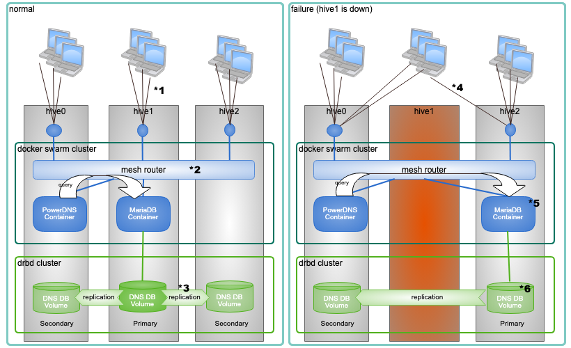

======================
概要
======================
hive-builder は複数台のサーバにまたがって docker コンテナを運用するサイトを構築するためのツールです。Kubernetes を使用せず docker swarm mode によるクラスタ機能と drbd9 によるディスク冗長化機能を使用することで、シンプルな構成でサイトを構築できます。
hive は巣箱の意味で、マイクロサービスの群れ(docker swarm)を収容し、これを運用管理します。

- コントローラを必要とせず、 hive を構成するサーバ（3台以上）が選挙によってリーダを選出する方式により split brain を防ぎます
- docker swarm クラスタを構築することで、高い可用性を確保できます
- drbd でディスクをミラーリングすることで、データボリュームを持つコンテナもマイグレーションできます
- コマンドを1回起動するだけでAWSなどの IaaS 上にサイトを構築できます
- ansible の role でコンテナの構築内容を記述できます
- サイトの初回起動時に初期データをロードできます
- サイト内にプライベートなリポジトリサーバを持ち、コンテナイメージを保存します
- サイト内にZabbix サーバを持ち、稼働を監視します
- 1個のインベントリから3段階のステージングに分けて環境を構築できます

.. warning::

   まだ、ドキュメントに未執筆部分がたくさんあることと、今後、非互換となる変更を行う可能性があることから、ビジネス用途の本番環境でご利用になるのは難しいかもしれません。
   本番環境でご利用になる場合はご一報ください。

.. warning::

   2.0.1 からホストのOSは CentOS 8 となり、1.2.3 以前のバージョンで構築された CentOS 7 によるサイトとは、互換性がなくなりました。
   サイトを再構築するか、1系の最新版（1.2.3）を利用してください。

サイト
======================
サイトは複数のコンテナ収容サーバと1台のリポジトリサーバから構成されます。

高可用性
---------------------
コンテナ収容サーバはリーダ選出選挙で高い可用性を確保するために3台以上配備する必要があります。
docker swarm mode と drbd9 の機能で高可用性を実現します。コンテナ収容サーバで構成されるクラスタを hive と呼びます。
以下にその仕組を説明します。

1. 利用者端末はGSLBにより、hive0-2の3個のグローバルIPアドレスに対してラウンドロビンで均等に割り当てられる
2. メッシュルータにより、各サービスがどのサーバで稼働しているかにかかわらず適切にルーティングされる
3. 常時 PrimaryからSecondary に更新内容が複製される
4. GSLBが死活監視によってhive1の停止を検知し、利用者端末に対してhive0,hive2のグローバルIPのみを返すようになる
5. swarmクラスタがhive1の機能停止を検知してLDAPサーバをhive2にマイグレーション
6. LDAPサーバのマイグレーションに連動して、hive2のボリュームがPrimary に自動的に昇格

ただし、GSLB の機能は hive-builder に含まれていません。hive-builder のサンプルとして Powerdns を使った
GSLB を添付していますので、これを構築して使っていただくか、route53 などの GSLB サービスを利用して
いただくことで、上記の高可用性サイトを構築していただけます。

リポジトリサーバ
---------------------
リポジトリサーバは以下の4つの機能を提供します。

リポジトリサービス
  コンテナイメージを保持し、コンテナ収容サーバに配信する

稼働監視サービス
  コンテナ収容サーバの健常性を監視する

バックアップサービス
  日次バッチでコンテナからバックアップを採取する

ログ収集サービス
  コンテナからログを収集してログファイルを作る

リポジトリサーバ自身が機能停止しても、hive はサービスを提供し続けることができます。
また、hive-builder で短時間で再構築できるため、バックアップを取る必要もありません。

構築フェーズ
======================
サイトの構築は、以下の7つのフェーズを順に実行することで行われます。

=================== =================== ==============================
フェーズ名          対象                内容
=================== =================== ==============================
build-infra         ホスト,ネットワーク ホストとネットワークを作成し、
                                        環境を構築する
setup-hosts         ホスト              ホストを設定する
build-images        コンテナイメージ    コンテナイメージをビルドする
build-networks      内部ネットワーク    内部ネットワークを構築する
build-volumes       ボリューム          ボリュームを構築する
deploy-services     サービス            サービスを配備する
initialize-services サービス            サービスを初期化する
=================== =================== ==============================

ステージング
======================
ステージングには以下の3つがあります。

=========== ===================
ステージ名  説明
=========== ===================
private     開発者個人のテスト環境です
staging     結合テストを実施する検証用の環境です
production  本番環境です
=========== ===================

すべてのステージを定義する必要はなく、必要に応じてインベントリにステージごとのインフラを
定義していただけます。
