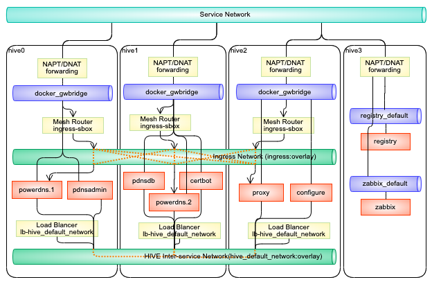
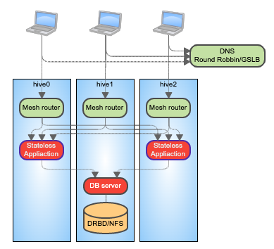
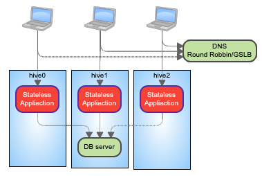
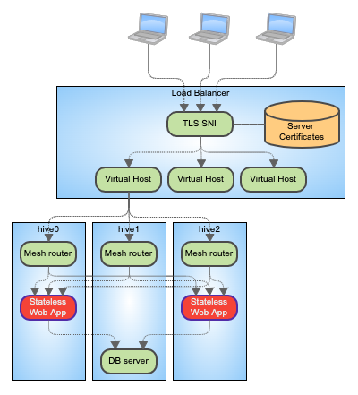
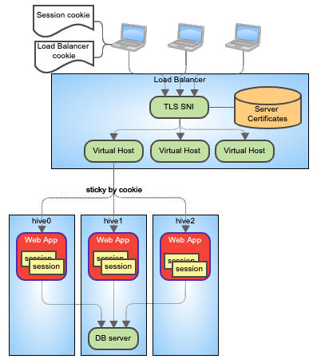
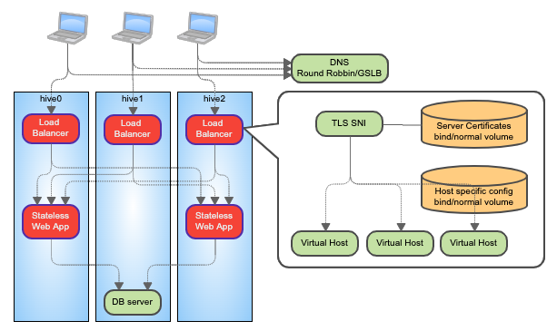
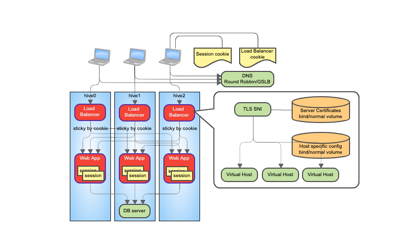
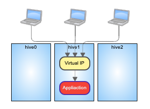

===============================
サービスパターン
===============================
この章では hive-builder のサービス定義でのボリュームとネットワークの構成方法について、パターンとして解説します。
パターンの選択の軸として、負荷分散軸、ボリューム軸、公開軸にわけて、以下に順次説明します。

.. warning::
    ここでは、サービスにボリューム、公開ポートが複数ある場合、その構成方法は統一することを前提としています。
    組み合わせによって構成方法を混合させることもできる場合もありますが、複雑になるため推奨されません。

負荷分散軸
----------------------------------------
サービスを実装するコンテナをクラスタ内で複数起動することで負荷分散することができます。
ここでは、コンテナの稼働数に着目して、パターンに分類します。

シングルトン
^^^^^^^^^^^^^^^^^^^^^^^^^^^^^^^^^^^^^^^^^^^
サービスとコンテナが１対１で、負荷分散を行わないサービス。
サービスの mode に replicated（デフォルト）を指定し、replicas に 1（デフォルト）を指定して利用します。

スケーラブル
^^^^^^^^^^^^^^^^^^^^^^^^^^^^^^^^^^^^^^^^^^^
サービスに対して複製のコンテナを配備し、負荷分散を行うサービス。
サービスの mode に replicated（デフォルト）を指定し、replicas に複製数を指定して利用します。

グローバル
^^^^^^^^^^^^^^^^^^^^^^^^^^^^^^^^^^^^^^^^^^^
コンテナ収容サーバごとにコンテナを配備し、外部のロードバランサで負荷分散を行うサービス。
サービスの mode に global を指定します。replicas は指定できません。

ボリューム軸
----------------------------------------
サービスに対してボリュームをどのように結合するかに着目して、パターン分けします。

ステートレス
^^^^^^^^^^^^^^^^^^^^^^^^^^^^^^^^^^^^^^^^^^^
サービスが一切ボリュームを持たないパターンです。リバースプロキシやステートレスななロジック層のサービスで利用できます。

サービス固有
^^^^^^^^^^^^^^^^^^^^^^^^^^^^^^^^^^^^^^^^^^^
サービスに対して固有のボリューム１個割り当てます。
データベースのサービスやデータベースを内包するスタンドアロン型のサービスのように、排他的にボリュームを利用する必要があるサービスでは、
このパターンを利用する必要があります。
サービスのコンテナがクラスタ間を移動した場合でも同じボリュームが見えるようにできます。
ボリュームはコンテナイメージの内容で初期化されます。
つまり、サービスの最初のコンテナが起動したとき１回だけコンテナイメージの内容がボリュームにコピーされます。
ボリュームは DRBD か NFSで構成されていなければなりません。
ただし、コンテナ収容サーバが１台構成である場合は、バインドボリュームや通常ボリュームを使用して（次節参照）、構成を単純化しビルドにかかる時間を短縮することができます。

ホスト固有
^^^^^^^^^^^^^^^^^^^^^^^^^^^^^^^^^^^^^^^^^^^
ホストごとに固有のボリュームを割り当てます。
前述の負荷分散軸でグローバルパターンを選択する場合で、ホストごとに内容に差を持たせたい場合に利用します。
バインドボリュームと通常ボリュームが利用できます。
バインドボリュームとは、コンテナが配備されたホストのディレクトリやファイルをコンテナにマウントするもので、ボリューム定義で type: bind を指定することで利用できます。
バインドボリュームで内容の初期化を addon ロールで行うことができます。
通常ボリュームとは、ホストごとに docker がオンデマンドにボリュームを作成するもので、ボリューム定義で type: volume（デフォルト） を指定し、NFS/DRBDを構成しないことで利用できます。
通常ボリュームでは、ボリュームはコンテナイメージの内容で初期化されます。
つまり、最初のサービスが起動したとき１回だけ内容がボリュームにコピーされます。

共有
^^^^^^^^^^^^^^^^^^^^^^^^^^^^^^^^^^^^^^^^^^^
サービスを実装する複数のコンテナ間でボリュームの内容を共有します。
ボリュームは NFSで構成されていなければなりません。
ボリュームへの書き込みの排他制御をサービス側で実装する必要があることに注意してください。
共通の設定情報を共有する場合など、ボリュームへの書き込みがない場合は、このパターンではなくビルド時にイメージに埋め込むことが推奨されます。

負荷分散軸とボリューム軸のパターンの組み合わせの可否
--------------------------------------------------------------------------------------------------
以下に、負荷分散軸とボリューム軸のパターンについて組み合わせの可否を示します。

+------------+------------+------------+------------+
|            |シングルトン|スケーラブル| グローバル |
+------------+------------+------------+------------+
|ステートレス|     ○      |     ○      |     ○      |
+------------+------------+------------+------------+
|サービス固有|     ○      |     ☓      |     ☓      |
+------------+------------+------------+------------+
|ホスト固有  |     ☓      |     ☓      |     ○      |
+------------+------------+------------+------------+
|共有        |     ☓      |     ○      |     ○      |
+------------+------------+------------+------------+

公開軸
----------------------------------------
サービス定義の ports 属性で公開することが宣言され、外部からのアクセスを受け付けるポートを公開ポートと呼びます。
公開ポートのパターンを説明するために、まず、docker swarm の内部ネットワークの仕組みについて説明します。

公開ポート宛のパケットは、サーバで着信し、DNAT により宛先IPアドレスが書き換えられ、 docker_gwbridge 経由でコンテナかメッシュルータに転送されます。

ここで、公開ポートの mode 属性に ingress を指定（デフォルト）している場合は、パケットはメッシュルータに送られます。
メッシュルータに着信したパケットは送信元IPと宛先IPの両方を書き換えられて、コンテナに転送されます。
公開ポートを持つサービスが複数のコンテナからなっている場合は負荷分散します。

一方で、公開ポートの mode 属性に host を指定している場合は、宛先IPが書き換えられ、直接コンテナに転送されます。

続いて、公開ポートにの構成方法に着目してパターン別に解説します。

内部サービス
^^^^^^^^^^^^^^^^^^^^^^^^^^^^^^^^^^^^^^^^^^^
サービス間通信のみをおこない、公開ポートを持たないサービスです。

.. warning::

    endpoint_mode に vip を指定すると、 ingress ネットワーク上にメッシュルータが配備されるだけではなく、
    hive_default_network ネットワークにもロードバランサが配備されます。
    他のコンテナからサービス名で内部サービスを参照する場合、コンテナ内DNSは実IPに加えてロードバランサにつけられた仮想IPも返します。
    不要なロードバランサと仮想IPを避けるために、内部サービスの endpoint_mode には、 dnsrr を指定することが推奨されます。

メッシュルーティング
^^^^^^^^^^^^^^^^^^^^^^^^^^^^^^^^^^^^^^^^^^^
外部からのアクセスをすべてのコンテナ収容サーバで受け付け、メッシュルータで転送するサービスです。
前述の負荷分散軸でグローバル以外のパターンを選択した場合に利用できます。
負荷分散を構成できますが、コンテナで受信するパケットの送信元IPはメッシュルータのIPで書き換えられるため、本来の送信元IPが不明となります。
port の公開モードに ingress (デフォルト)を指定して利用します。サービスの endpoint_mode は vip (デフォルト)でなければなりません。

一対一ルーティング
^^^^^^^^^^^^^^^^^^^^^^^^^^^^^^^^^^^^^^^^^^^
外部からのアクセスをすべてのコンテナ収容サーバで受け付け、サーバ内のコンテナに転送するサービスです。
前述の負荷分散軸でグローバルパターンを選択した場合にのみ利用できます。
port の公開モードに host を指定して利用します。
サービスの endpoint_mode には dnsrr を指定しなければなりません。

仮想IP
^^^^^^^^^^^^^^^^^^^^^^^^^^^^^^^^^^^^^^^^^^^
コンテナが配置されたホストに swarm 拡張機能で仮想IPを付与し、その仮想IPへの通信をコンテナに転送するパターンです。
負荷分散軸でシングルトンパターンを選択した場合にのみ利用できます。

.. warning::

    内部サービスの場合と同じ理由で、仮想IPでポートを公開するサービスの endpoint_mode には、 dnsrr を指定することが推奨されます。

構成ガイド
----------------------------------------
サービスの種類ごとに推奨される構成を示します。

ステートレスメッシュルーティング
^^^^^^^^^^^^^^^^^^^^^^^^^^^^^^^^^^^^^^^^^^^
インターネットからのアクセスを GSLB で冗長化し、リバースプロキシサービスで受信する場合、コンテナをグローバルパターンで配備することが推奨されます。
DNS や RADIUS などクライアント側に複数IPフォールバック（複数のIPに対して１個めにアクセスしてみてだめなら２個めにアクセスする）がある場合を含みます。
DNSサーバのようなステートレスなサービスをシンプルに冗長化することができます。
以下にステートレスなサービスとDBサービスで構成する場合の図を示します。

それぞれの軸のパターンを以下のように選択します。

Statteless Application

================== ==================
パターン軸           パターン
================== ==================
負荷分散軸           スケーラブル
ボリューム軸       ステートレス
公開軸              メッシュルーティング
================== ==================

DB Server

================== ==================
パターン軸           パターン
================== ==================
負荷分散軸           シングルトン
ボリューム軸       サービス固有
公開軸              内部サービス
================== ==================

- replica 属性でスケールを調整できます
- 受診時の送信元IPをアプリケーションで識別することはできません

以下に設定例を示します。

::

    ---
    plugin: hive_services
    services:
      powerdns:
        image: procube/powerdns:latest
        environment:
          MYSQL_PASSWORD: "{{db_password}}"
          MYSQL_HOST: pdnsdb
          MYSQL_DNSSEC: "yes"
          MYSQL_CHECK_INTERVAL: "10"
          MYSQL_CHECK_RETRY: "50"
        command:
        - "--api=yes"
        - "--api-key={{db_password}}"
        - "--webserver=yes"
        - "--webserver-address=0.0.0.0"
        - "--webserver-allow-from=0.0.0.0/0"
        ports:
        - target_port: 53
          published_port: 53
          protocol: udp
          mode: ingress
        - target_port: 53
          published_port: 53
          protocol: tcp
          mode: ingress
        initialize_roles:
        - python-aptk
        - powerdns-init
        mode: replicated
        replicas: 2
        endpoint_mode: vip
      pdnsdb:
        image:
        from: "mariadb:10.4"
        roles:
        - python-aptk
        - powerdns-initdb
        endpoint_mode: dnsrr
        environment:
          MYSQL_ROOT_PASSWORD: "{{db_password}}"
          MYSQL_USER: powerdns
          MYSQL_PASSWORD: "{{db_password}}"
          MYSQL_DATABASE: powerdns
        volumes:
        - source: pdnsdb_data
          target: /var/lib/mysql
          type: volume
          drbd:
            size: 500M
            fstype: xfs

ステートレスグローバル
^^^^^^^^^^^^^^^^^^^^^^^^^^^^^^^^^^^^^^^^^^^
DNSのアクセス制御やVIEW制御のような機能を実装する場合など、前項の構成で送信元IPを識別できないことが問題となる場合は、グローバルパターンを使用する必要があります。
以下に図を示します。

DB Server については、ステートレスメッシュルーティングの項で記載した内容から変更がありませんので、説明を省略します。
Statteless Application の軸のパターンを以下のように選択します。

================== ==================
パターン軸           パターン
================== ==================
負荷分散軸           グローバル
ボリューム軸       ステートレス
公開軸              一対一ルーティング
================== ==================

- クライアントからのアクセスは GSLBで冗長負荷分散され、コンテナ収容サーバごとに1個ずつ配備されたコンテナで受信します
- 受診時の送信元IPをアプリケーションで識別して、アクセス制御やVIEW制御に使用できます
- 複製数はサーバ数に固定されます

以下に設定例を示します。

::

    ---
    plugin: hive_services
    services:
      powerdns:
        image: procube/powerdns:latest
        environment:
          MYSQL_PASSWORD: "{{db_password}}"
          MYSQL_HOST: pdnsdb
          MYSQL_DNSSEC: "yes"
          MYSQL_CHECK_INTERVAL: "10"
          MYSQL_CHECK_RETRY: "50"
        command:
        - "--api=yes"
        - "--api-key={{db_password}}"
        - "--webserver=yes"
        - "--webserver-address=0.0.0.0"
        - "--webserver-allow-from=0.0.0.0/0"
        mode: global
        endpoint_mode: dnsrr
        ports:
        - target_port: 53
          published_port: 53
          protocol: udp
          mode: host
        - target_port: 53
          published_port: 53
          protocol: tcp
          mode: host
        initialize_roles:
        - python-aptk
        - powerdns-init

ロードバランサ背後ステートレスメッシュルーティング
^^^^^^^^^^^^^^^^^^^^^^^^^^^^^^^^^^^^^^^^^^^^^^^^^^^^^^^^^^^^^
インターネットからのアクセスを外部のロードバランサで受け付けて、コンテナ収容サーバに負荷分散して転送する場合、ステーテレスなWebサービスをメッシュルーティングパターンで公開することが推奨されます。

DB Server については、ステートレスメッシュルーティングの項で記載した内容から変更がありませんので、説明を省略します。
Statteless Application の軸のパターンを以下のように選択します。

================== ==================
パターン軸           パターン
================== ==================
負荷分散軸           スケーラブル
ボリューム軸       ステートレス
公開軸              メッシュルーティング
================== ==================

- replica 属性でスケールを調整できます。
- データベースをコンテナ内に持たないようにしてステートレスパターンを採用します
- 受診時の送信元IPはロードバランサのIPアドレスになるので、メッシュルーティングを採用することのデメリットはありません。
- 送信元IPは送信元IPは外部のロードバランサが追加するX-Forwarded-Forヘッダで識別できますので、アクセスログにその値を記録できます
- サーバ証明書はロードバランサで保持してさせロードバランサとの間は非暗号化通信とすることで、コンテナ内でのサーバ証明書の交換は不要となります
- メッシュルータから負荷分散で転送する場合はスティッキーセッションが使用できないので、セッション情報などをコンテナごとのメモリ上に保持するようなアプリケーションには適用できません（セッション情報をDBで共有することでステートレス化する必要があります）

以下に設定例を示します。

::

    ---
    plugin: hive_services
    services:
      speedtest:
        image: linuxserver/librespeed
        environment:
          PUID: "1000"
          PGID: "1000"
          TZ: Asia/Tokyo
          DB_TYPE: mysql
          DB_NAME: speedtest
          DB_HOSTNAME: stdb
          DB_USERNAME: speedtest
          DB_PASSWORD: speedtest
        mode: replicated
        replicas: 2
        endpoint_mode: vip
        ports:
        - target_port: 80
          published_port: 80
          protocol: tcp
          mode: ingress

ロードバランサ背後スティッキーグローバル
^^^^^^^^^^^^^^^^^^^^^^^^^^^^^^^^^^^^^^^^^^^
セッション情報などをコンテナごとのメモリ上に保持するようなアプリケーションであるため、前項のパターンのスティッキーセッションを利用できないことが問題となる場合は、グローバルパターンを使用する必要があります。
以下に図を示します。

DB Server については、ステートレスメッシュルーティングの項で記載した内容から変更がありませんので、説明を省略します。
Web App の軸のパターンを以下のように選択します。

================== ==================
パターン軸           パターン
================== ==================
負荷分散軸           グローバル
ボリューム軸       ステートレス
公開軸              一対一ルーティング
================== ==================

- データベースをコンテナ内に持たないようにしてステートレスパターンを採用します
- 受診時の送信元IPはクライアントのIPアドレスとなり、アクセスログに記録することが可能です
- サーバ証明書はロードバランサに保持させロードバランサとの間は非暗号化通信とすることで、コンテナ内でのサーバ証明書の交換は不要となります
- ロードバランサからの負荷分散でスティッキーセッションを使用することで、セッション情報などをコンテナごとのメモリ上に保持するようなアプリケーションにも適用できます

以下に設定例を示します。

::

    ---
    plugin: hive_services
    services:
      speedtest:
        image: linuxserver/librespeed
        environment:
          PUID: "1000"
          PGID: "1000"
          TZ: Asia/Tokyo
          DB_TYPE: mysql
          DB_NAME: speedtest
          DB_HOSTNAME: stdb
          DB_USERNAME: speedtest
          DB_PASSWORD: speedtest
        mode: global
        endpoint_mode: dnsrr
        ports:
        - target_port: 80
          published_port: 80
          protocol: tcp
          mode: host

内蔵ロードバランサ
^^^^^^^^^^^^^^^^^^^^^^^^^^^^^^^^^^^^^^^^^^^
インターネットからのアクセスを GSLB で冗長不可分させ、ロードバランササービスで受信する場合、コンテナをグローバルパターンで配備することが推奨されます。
Apache httpd や nginx のような Web のリバースプロキシをロードバランサとして Web サービスの前段に立てる場合に使用します。
また、 dnsdist など非 Web の L7 プロキシの場合にも利用できるパターンです。
以下に図を示します。

DB Server については、ステートレスメッシュルーティングの項で記載した内容から変更がありませんので、説明を省略します。
それぞれの軸のパターンを以下のように選択します。

Load Balancer

================== ==================
パターン軸           パターン
================== ==================
負荷分散軸           グローバル
ボリューム軸       ホスト固有
公開軸              一対一ルーティング
================== ==================

Statteless Application

================== ==================
パターン軸           パターン
================== ==================
負荷分散軸           スケーラブル
ボリューム軸       ステートレス
公開軸              メッシュルーティング
================== ==================

- クライアントからのアクセスは GSLBで冗長負荷分散され、コンテナ収容サーバごとに1個ずつ配備されたコンテナで受信します
- 構成情報やサーバ証明書はホスト固有パターンのボリュームに保存することで、サービスを再起動せずに構成変更やサーバ証明書を交換できるようにします
- 受診時の送信元IPはクライアントのIPアドレスとなり、アクセスログに記録することが可能です
- Statteless Application については、 replica 属性でスケールを調整できます。
- メッシュルータから負荷分散で転送する場合はスティッキーセッションが使用できないので、セッション情報などをコンテナごとのメモリ上に保持するようなアプリケーションには適用できません（セッション情報をDBで共有することでステートレス化する必要があります）

以下に設定例を示します。

::

    ---
    plugin: hive_services
    services:
      proxy:
        image: "procube/nginx:latest"
        mode: global
        endpoint_mode: dnsrr
        ports:
        - target_port: 80
          published_port: 80
          protocol: tcp
          mode: host
        - target_port: 443
          published_port: 443
          protocol: tcp
          mode: host
        volumes:
        - source: /var/proxy/nginx/conf.d
          target: /etc/nginx/conf.d
          type: bind
        - source: /var/proxy/pki/tls/
          target: /etc/pki/tls/
          type: bind
      speedtest:
        image: linuxserver/librespeed
        environment:
          PUID: "1000"
          PGID: "1000"
          TZ: Asia/Tokyo
          DB_TYPE: mysql
          DB_NAME: speedtest
          DB_HOSTNAME: stdb
          DB_USERNAME: speedtest
          DB_PASSWORD: speedtest
        mode: replicated
        replicas: 2
        endpoint_mode: dnsrr

スティッキー対応内蔵ロードバランサ
^^^^^^^^^^^^^^^^^^^^^^^^^^^^^^^^^^^^^^^^^^^
セッション情報などをコンテナごとのメモリ上に保持するようなアプリケーションであるため、前項のパターンのスティッキーセッションを利用できないことが問題となる場合は、
Webアプリケーションをグローバルで配置し、一対一ルーティングでパケットを転送することで、内蔵ロードバランサからホストのIPアドレスに対してスティッキーセッションで負荷分散することができます。
以下に図を示します。

DB Server については、ステートレスメッシュルーティングの項で記載した内容から変更がありませんので、説明を省略します。
それぞれの軸のパターンを以下のように選択します。

Load Balancer

================== ==================
パターン軸           パターン
================== ==================
負荷分散軸           シングルトン
ボリューム軸       
公開軸              一対一ルーティング
================== ==================

Web App

================== ==================
パターン軸           パターン
================== ==================
負荷分散軸           グローバル
ボリューム軸       ステートレス
公開軸              一対一ルーティング
================== ==================

- クライアントからのアクセスは GSLBで冗長負荷分散され、コンテナ収容サーバごとに1個ずつ配備されたコンテナで受信します
- 構成情報やサーバ証明書はホスト固有パターンのボリュームに保存することで、サービスを再起動せずに構成変更やサーバ証明書を交換できるようにします
- 受診時の送信元IPはクライアントのIPアドレスとなり、アクセスログに記録することが可能です
- ロードバランサからの負荷分散でスティッキーセッションを使用することで、セッション情報などをコンテナごとのメモリ上に保持するようなアプリケーションにも適用できます
- Web App のポート公開については、外部への公開をしないことをマークするために 10000以上のポート番号を付与してください
- 内蔵ロードバランサからアップストリームへの転送は Web App のサービス名ではなく、コンテナ収容サーバのホスト名で行ってください

以下に設定例を示します。

::

    ---
    plugin: hive_services
    services:
      proxy:
        image: "procube/nginx:latest"
        mode: global
        endpoint_mode: dnsrr
        ports:
        - target_port: 80
          published_port: 80
          protocol: tcp
          mode: host
        - target_port: 443
          published_port: 443
          protocol: tcp
         mode: host
        volumes:
        - source: /var/proxy/nginx/conf.d
          target: /etc/nginx/conf.d
          type: bind
        - source: /var/proxy/pki/tls/
          target: /etc/pki/tls/
          type: bind
      speedtest:
        image: linuxserver/librespeed
        environment:
          PUID: "1000"
          PGID: "1000"
          TZ: Asia/Tokyo
          DB_TYPE: mysql
          DB_NAME: speedtest
          DB_HOSTNAME: stdb
          DB_USERNAME: speedtest
          DB_PASSWORD: speedtest
        mode: global
        endpoint_mode: dnsrr
        ports:
        - target_port: 80
          published_port: 10080
          protocol: tcp
          mode: host

仮想IP
^^^^^^^^^^^^^^^^^^^^^^^^^^^^^^^^^^^^^^^^^^^
オンプレミスのサーバでは、サービスをシングルトンで配備し、Swarm 拡張機能で、仮想IPを利用することができます。
以下に図を示します。

Application の軸のパターンを以下のように選択します。

Application

================== ==================
パターン軸           パターン
================== ==================
負荷分散軸           シングルトン
ボリューム軸       サービス固有
公開軸              仮想IP
================== ==================

- コンテナ1個で実装され、負荷分散はありません
- 受診時の送信元IPはクライアントのIPアドレスとなり、アクセスログに記録することが可能です
- サービス固有ボリュームを持つことでステートフルなアプリケーションでも実装可能です

以下に設定例を示します。

::

    ---
    plugin: hive_services
    services:
      speedtest:
        image: linuxserver/librespeed
        environment:
          PUID: "1000"
          PGID: "1000"
          TZ: Asia/Tokyo
          DB_TYPE: mysql
          DB_NAME: speedtest
          DB_HOSTNAME: stdb
          DB_USERNAME: speedtest
          DB_PASSWORD: speedtest
        mode: replicated
        replicas: 1
        endpoint_mode: dnsrr
        ports:
        - target_port: 80
          published_port: 80
          protocol: tcp
          mode: host
        - target_port: 443
          published_port: 443
          protocol: tcp
          mode: host
